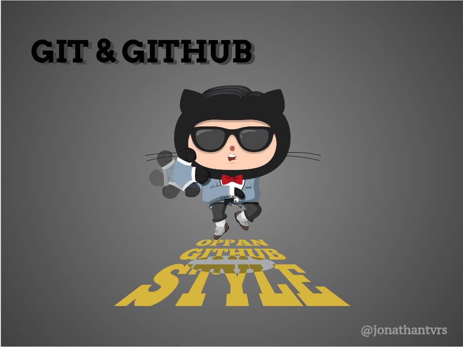

# Terceiro MeetUp - Dev Seridó

## :calendar: Quando aconteceu?

- 15/jul do ano de 2020 das 17h às 18h30

## :round_pushpin: Onde aconteceu?

- No [Google Meet](https://meet.google.com/czn-stix-imm)

## :speech_balloon: O que foi abordado?

- Motivos da existência do versionamento com GIT
- A importância do GIT para o desenvolvedor
- Comandos e options mais utilizados no dia a dia do trabalho em times
- Atenção especial aos comandos git rebase e git merge na resolução de conflitos
- GitHub, suas features e sua importância como currículo para o desenvolvedor

## :heavy_check_mark: O que foi produzido?

 - [Apresentação sobre Git e GitHub](https://docs.google.com/presentation/d/1CYRfiOdBof2mX4fVRSci5aFUMhBhvgTW_m7rF_hrER4/edit?usp=sharing)

## :globe_with_meridians: Links importantes

 1. [Site Oficial do GIT](https://git-scm.com/)
 2. [Site Oficial do GITHUB](https://github.com/)
 3. [Site para aprender conteúdos sobre GIT](https://try.github.io/)

## :handshake: Quem participou?

- Jonathan Tavares 
- João Pedro Fonseca
- José Eduardo
- Ayrton Dantas
- Wesley Vitor
- Charles Bezerra
- Ítalo de Azevedo
- Jackson Alves
- Neylane Lopes
- Deyvid Willian
- Otton Maia
- Henrique Lopes
